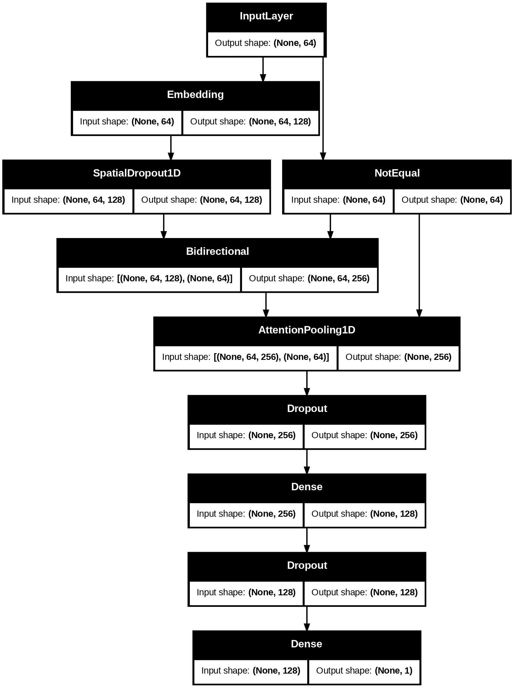

# HATE SPEECH CLASSIFIER MODEL
> Hate Speech Classifier model trained using [this dataset](https://drive.google.com/file/d/1_XsweOGUzjYDbQqibSvI8M3X1hvycd8F/view?usp=drive_link), uploaded to [Hugging Face Hub](https://huggingface.co/diyorarti/hate-speech-attn-bigru-keras).  
The model is deployed via **Hugging Face Inference API**, and the **production-ready API** is hosted on **Render**.

## 🩺 Project Overview
In today's digital world, online comments appear everywhere — from social media platforms to product review sections. While many users share constructive feedback politely, others post hateful or offensive comments. Such hate speech can cause emotional stress, anxiety, and other mental health issues for creators and business owners.

To address this problem, I developed a **Hate Speech Classifier** that automatically detects whether a given comment is hateful or not. The model is deployed as a **production-ready API**, allowing developers and organizations to easily integrate hate-speech detection into their applications and services.

## ⚙️ Tech Stack

| Area | Technologies |
|------|---------------|
| **Programming Language** | Python |
| **Development Environment** | Google Colab (GPU) |
| **Data Visualization** | Matplotlib, Seaborn, WordCloud |
| **Natural Language Processing** | NLTK |
| **Deep Learning Framework** | TensorFlow / Keras |
| **Experiment Tracking** | Weights & Biases (wandb) |
| **API Framework** | FastAPI |
| **Async HTTP Client** | HTTPX |
| **Containerization** | Docker |
| **Deployment** | Hugging Face Inference API, Render |
---

## 🧠 Model Details

| Item | Description |
|------|--------------|
| **Model Name** | Hate-Speech-Attn-BiGRU |
| **Architecture** | Bidirectional GRU (BiGRU) with Attention Layer |
| **Framework** | TensorFlow / Keras |
| **Tokenizer** | Keras Tokenizer with padded sequences |
| **Dataset** | [Hate Speech Dataset](https://drive.google.com/file/d/1_XsweOGUzjYDbQqibSvI8M3X1hvycd8F/view?usp=drive_link) |
| **Repository (Model)** | [Hugging Face Hub](https://huggingface.co/diyorarti/hate-speech-attn-bigru-keras) |
### Model architecture 

---
## 📊 Model Performance & Evaluation

### 🧪 Evaluation Protocol
- Split: Train / Val / Test (threshold tuned on **validation**, then evaluated on **test**)
- Task: Binary classification → **hate (1)** vs **non-hate (0)**
- Threshold selection: sweep `t ∈ [0.10, 0.90]` (step 0.01) on validation; choose max **macro-F1**
  - ✅ Best validation threshold: **t = 0.540**
  - ✅ Best validation macro-F1: **0.8587**

---

### 📈 Validation Metrics (t = 0.540)

| Metric            | Macro | Class 0 (non-hate) | Class 1 (hate) |
|-------------------|:-----:|:------------------:|:--------------:|
| **Precision**     | 0.860 | 0.8711             | 0.8497         |
| **Recall**        | 0.858 | 0.8277             | 0.8884         |
| **F1-Score**      | 0.8587| 0.8488             | 0.8686         |
| **Accuracy**      | **0.8594** | —            | —              |
| **Support**       | —     | 34,564             | 37,908         |

**Confusion Matrix (Val)**  
TN=28,607 · FP=5,957 · FN=4,232 · TP=33,676

|               | Pred 0 | Pred 1 |
|---------------|:------:|:------:|
| **True 0**    | 28,607 | 5,957  |
| **True 1**    | 4,232  | 33,676 |

> The model is slightly **recall-oriented** for the hate class (1), which is often desirable for moderation.

---

### 🧪 Test Metrics (t = 0.500)

| Metric            | Macro | Class 0 (non-hate) | Class 1 (hate) |
|-------------------|:-----:|:------------------:|:--------------:|
| **Precision**     | 0.8619| 0.8852             | 0.8385         |
| **Recall**        | 0.8567| 0.8090             | 0.9043         |
| **F1-Score**      | 0.8578| 0.8454             | 0.8702         |
| **Accuracy**      | **0.8589** | —            | —              |
| **Support**       | —     | 34,565             | 37,907         |

> If you apply the **validation-optimal threshold (0.54)** on test, expect a small precision/recall trade-off similar to validation.

---

### 🧩 Model Performance Summary

The model demonstrates strong and balanced performance with approximately **86% accuracy and macro-F1** on both validation and test sets. It effectively captures hateful content with a **high recall (~0.90)** while maintaining good precision (~0.84), making it suitable for real-world moderation systems where minimizing missed hate speech is critical.  

The **BiGRU + Attention** architecture enables the model to understand both word context and emotional tone, leading to consistent performance across unseen data. The training and validation curves confirm that the model generalizes well without significant overfitting.

### 🧮 Experiment Tracking (Weights & Biases)

All training runs, metrics, and visualizations were tracked in **Weights & Biases (wandb)** for reproducibility and experiment monitoring.  
You can explore full training logs, learning curves, and performance charts here:

🔗 **[View in Weights & Biases Dashboard](https://wandb.ai/diyor/hate-speech-classifer?nw=nwuserdiyorarti)**

The dashboard includes:
- Epoch-wise **training & validation accuracy/loss curves**
- **Precision, recall, and F1-score** evolution
- Confusion matrices and sample predictions
- Logged hyperparameters and environment configuration
